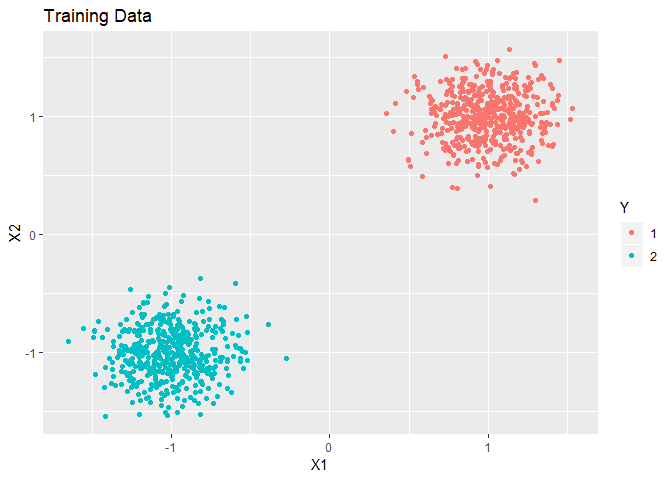
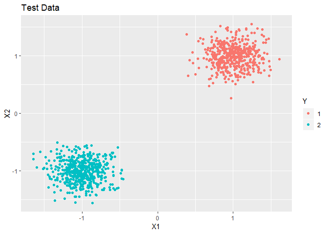

<!-- README.md is generated from README.Rmd. Please edit that file -->

# dann

<!-- badges: start -->

<!-- badges: end -->

An Implementation of Hastie and Tibshirani’s Discriminant Adaptive
Nearest Neighbor Classification in R.

## Installation

You can install the released version of dann from
[CRAN](https://CRAN.R-project.org) with:

``` r
# Not on CRAN yet. Under development.
#install.packages("dann")
```

And the development version from [GitHub](https://github.com/) with:

``` r
# install.packages("devtools")
devtools::install_github("gmcmacran/dann")
```

## Example 1: Circle Problem

``` r
library(dann)
library(dplyr)
#> 
#> Attaching package: 'dplyr'
#> The following objects are masked from 'package:stats':
#> 
#>     filter, lag
#> The following objects are masked from 'package:base':
#> 
#>     intersect, setdiff, setequal, union
library(ggplot2)
library(mlbench)

set.seed(1)

#Create training data
train <- mlbench.circle(500, 2) %>%
  tibble::as_tibble()
colnames(train) <- c("X1", "X2", "Y")

ggplot(train, aes(x = X1, y = X2, colour = Y)) + 
  geom_point() + 
  labs(title = "Training Data")
```


``` r

xTrain <- train %>%
  select(X1, X2) %>%
  as.matrix()

yTrain <- train %>%
  pull(Y) %>%
  as.numeric() %>%
  as.matrix()

#Create test data
test <- mlbench.circle(500, 2) %>%
  tibble::as_tibble()
colnames(test) <- c("X1", "X2", "Y")

ggplot(test, aes(x = X1, y = X2, colour = Y)) + 
  geom_point() + 
  labs(title = "Test Data")
```


``` r

xTest <- test %>%
  select(X1, X2) %>%
  as.matrix()

yTest <- test %>%
  pull(Y) %>%
  as.numeric() %>%
  as.matrix()

# Train and predict using dann from elements of statistical learning.
dannPreds <- dann(xTrain, yTrain, xTest, 7, 50, 1)
mean(dannPreds == yTest)
#> [1] 0.964
```

## Example 2: Clustered Data

``` r

set.seed(1)
train <- mlbench.2dnormals(1000, cl = 2, r = sqrt(2), sd = .2) %>%
  tibble::as_tibble()
colnames(train) <- c("X1", "X2", "Y")

ggplot(train, aes(x = X1, y = X2, colour = Y)) + 
  geom_point() + 
  labs(title = "Training Data")
```



``` r

xTrain <- train %>%
  select(X1, X2) %>%
  as.matrix()

yTrain <- train %>%
  pull(Y) %>%
  as.numeric() %>%
  as.matrix()

test <- mlbench.2dnormals(1000, cl = 2, r = sqrt(2), sd = .2) %>%
  tibble::as_tibble()
colnames(test) <- c("X1", "X2", "Y")

ggplot(test, aes(x = X1, y = X2, colour = Y)) + 
  geom_point() + 
  labs(title = "Test Data")
```



``` r

xTest <- test %>%
  select(X1, X2) %>%
  as.matrix()

yTest <- test %>%
  pull(Y) %>%
  as.numeric() %>%
  as.matrix()

# Train and predict using dann from elements of statistical learning.
dannPreds <- dann(xTrain, yTrain, xTest, 5, 50, 1)
mean(dannPreds == yTest)
#> [1] 1
```

This package in an R port of Christopher Jenness’s python
[implementation.](https://github.com/christopherjenness/ML-lib).
