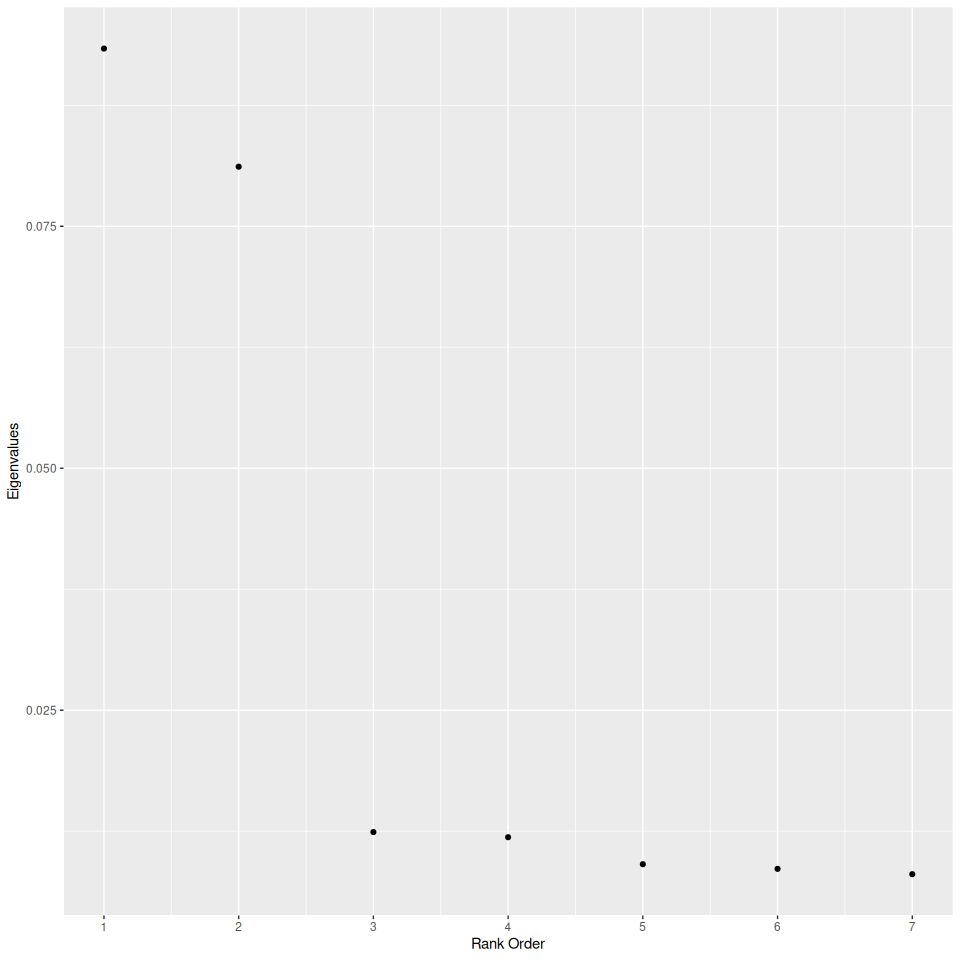

<!-- README.md is generated from README.Rmd. Please edit that file -->

# DANN

<!-- badges: start -->

[](https://github.com/gmcmacran/dann/actions/workflows/R-CMD-check.yaml)
[](https://app.codecov.io/gh/gmcmacran/dann?branch=main)
[](https://cran.r-project.org/package=dann)

<!-- badges: end -->

An implementation of Hastie and Tibshirani’s Discriminant Adaptive
Nearest Neighbor Classification in R.

## Package Introduction

In k nearest neighbors, the shape of the neighborhood is usually
circular. Discriminant Adaptive Nearest Neighbor (dann) is a variation
of k nearest neighbors where the shape of the neighborhood is data
driven. The neighborhood is elongated along class boundaries and shrunk
in the orthogonal direction. See [Discriminate Adaptive Nearest Neighbor
Classification](https://web.stanford.edu/~hastie/Papers/dann_IEEE.pdf)
by Hastie and Tibshirani.

Models:

- dann
- sub-dann

This package implements DANN and sub-DANN in section 4.1 of the
publication and is based on Christopher Jenness’s python
[implementation.](https://github.com/christopherjenness/ML-lib)

## Example 1: dann

Arguments:

- k - The number of points in the neighborhood. Identical to k in
  standard k nearest neighbors.
- neighborhood_size - The number of data points used to estimate a good
  shape for the neighborhood.
- epsilon - Softening parameter. Usually has the least affect on
  performance.

In this example, simulated data is made. The overall trend is a circle
inside a square.

``` r
library(dann)
library(dplyr, warn.conflicts = FALSE)
library(ggplot2)
library(mlbench)

set.seed(1)

# Create training data
train <- mlbench.circle(500, 2) %>%
  tibble::as_tibble()
colnames(train) <- c("X1", "X2", "Y")
train <- train %>%
  mutate(Y = as.numeric(Y))

ggplot(train, aes(x = X1, y = X2, colour = as.factor(Y))) +
  geom_point() +
  labs(title = "Train Data", colour = "Y")
```


To train a model, call dann.

``` r
model <- dann(formula = Y ~ X1 + X2, data = train, k = 5, neighborhood_size = 50, epsilon = 1)
```

To get class predictions, call predict with type equal to “class”

``` r
# Create test data
test <- mlbench.circle(500, 2) %>%
  tibble::as_tibble()
colnames(test) <- c("X1", "X2", "Y")
test <- test %>%
  mutate(Y = as.numeric(Y))

yhat <- predict(object = model, new_data = test, type = "class")
yhat
#> # A tibble: 500 × 1
#>    .pred_class
#>    <fct>      
#>  1 2          
#>  2 1          
#>  3 1          
#>  4 2          
#>  5 2          
#>  6 2          
#>  7 1          
#>  8 1          
#>  9 2          
#> 10 1          
#> # ℹ 490 more rows
```

To get probabilities, call predict with type equal to “prob”

``` r
yhat <- predict(object = model, new_data = test, type = "prob")
yhat
#> # A tibble: 500 × 2
#>    .pred_1 .pred_2
#>      <dbl>   <dbl>
#>  1     0       1  
#>  2     0.6     0.4
#>  3     1       0  
#>  4     0       1  
#>  5     0       1  
#>  6     0       1  
#>  7     1       0  
#>  8     1       0  
#>  9     0       1  
#> 10     1       0  
#> # ℹ 490 more rows
```

## Example 2: sub_dann

In general, dann will struggle as unrelated variables are intermingled
with informative variables. To deal with this, sub_dann projects the
data onto a unique subspace and then calls dann on the subspace.

# Arguments

- k - The number of points in the neighborhood. Identical to k in
  standard k nearest neighbors.
- neighborhood_size - The number of data points used to estimate a good
  shape for the neighborhood.
- epsilon - Softening parameter. Usually has the least affect on
  performance.
- weighted - Should the individual between class covariance matrices be
  weighted? FALSE corresponds to original publication.
- sphere - Type of covariance matrix to calculate.
- numDim - The number of dimensions to project the predictor variables
  on to.

In the below example there are 2 related variables and 5 that are
unrelated. Will sub_dann to better than dann?

``` r
######################
# Circle data with unrelated variables
######################
set.seed(1)
train <- mlbench.circle(500, 2) %>%
  tibble::as_tibble()
colnames(train)[1:3] <- c("X1", "X2", "Y")

# Add 5 unrelated variables
train <- train %>%
  mutate(
    U1 = runif(500, -1, 1),
    U2 = runif(500, -1, 1),
    U3 = runif(500, -1, 1),
    U4 = runif(500, -1, 1),
    U5 = runif(500, -1, 1)
  )

test <- mlbench.circle(500, 2) %>%
  tibble::as_tibble()
colnames(test)[1:3] <- c("X1", "X2", "Y")

# Add 5 unrelated variables
test <- test %>%
  mutate(
    U1 = runif(500, -1, 1),
    U2 = runif(500, -1, 1),
    U3 = runif(500, -1, 1),
    U4 = runif(500, -1, 1),
    U5 = runif(500, -1, 1)
  )
```

For sub_dann, the dimension of the subspace should be chosen based on
the number of large eigenvalues. The graph suggests 2 (the correct
answer).

``` r
graph_eigenvalues(
  formula = Y ~ X1 + X2 + U1 + U2 + U3 + U4 + U5,
  data = train,
  neighborhood_size = 50,
  weighted = FALSE,
  sphere = "mcd"
)
```



``` r
dann_model <- dann(
  formula = Y ~ X1 + X2 + U1 + U2 + U3 + U4 + U5,
  data = train,
  k = 3,
  neighborhood_size = 50,
  epsilon = 1
)
# numDim based on large eigenvalues
# weighted, sphere, and neighborhood_size kept consistent between sub_dann and graph_eigenvalues
sub_dann_model <- sub_dann(
  formula = Y ~ X1 + X2 + U1 + U2 + U3 + U4 + U5,
  data = train,
  k = 3,
  neighborhood_size = 50,
  epsilon = 1,
  weighted = FALSE,
  sphere = "mcd",
  numDim = 2
)
```

As expected, the dann model using all features does not fit the data
well.

``` r
library(yardstick)
dann_yhat <- predict(object = dann_model, new_data = test, type = "prob")
dann_yhat <- test %>%
  select(Y) %>%
  bind_cols(dann_yhat)
roc_auc(data = dann_yhat, truth = Y, event_level = "first", .pred_1)
#> # A tibble: 1 × 3
#>   .metric .estimator .estimate
#>   <chr>   <chr>          <dbl>
#> 1 roc_auc binary         0.725
```

sub_dann provides a major improvement.

``` r
sub_dann_yhat <- predict(object = sub_dann_model, new_data = test, type = "prob")
sub_dann_yhat <- test %>%
  select(Y) %>%
  bind_cols(sub_dann_yhat)
roc_auc(data = sub_dann_yhat, truth = Y, event_level = "first", .pred_1)
#> # A tibble: 1 × 3
#>   .metric .estimator .estimate
#>   <chr>   <chr>          <dbl>
#> 1 roc_auc binary         0.935
```
