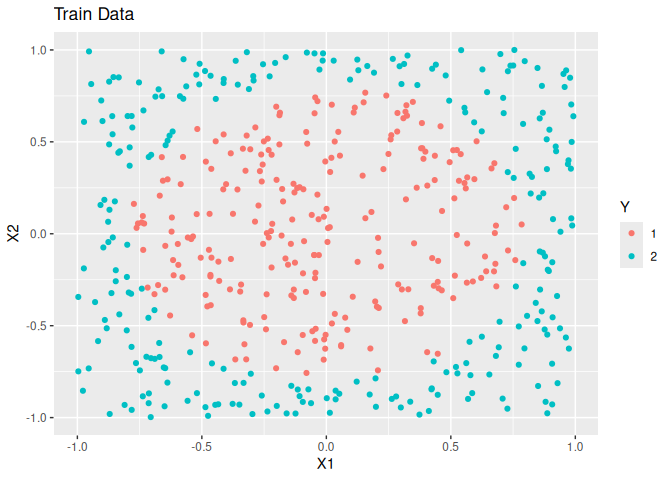
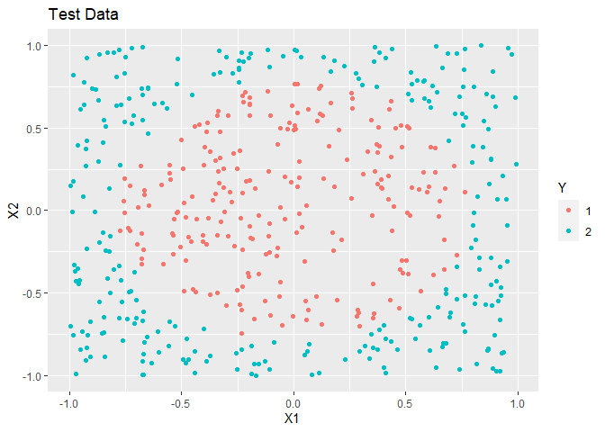

<!-- README.md is generated from README.Rmd. Please edit that file -->

# DANN

<!-- badges: start -->

[](https://travis-ci.org/gmcmacran/dann)
[](https://codecov.io/gh/gmcmacran/dann?branch=master)
[](https://cran.r-project.org/package=dann)
<!-- badges: end -->

An Implementation of Hastie and Tibshirani’s Discriminant Adaptive
Nearest Neighbor Classification in R.

## Installation

You can install the released version of dann from
[CRAN](https://CRAN.R-project.org) with:

``` r
#install.packages("dann")
```

And the development version from [GitHub](https://github.com/) with:

``` r
# install.packages("devtools")
devtools::install_github("gmcmacran/dann")
```

# Package Introduction

DANN is a variation of k nearest neighbors where the shape of the
neighborhood takes into account training data’s class. The neighborhood
is elongated along class boundaries and shrunk in the orthogonal
direction to class boundaries. See [Discriminate Adaptive Nearest
Neighbor
Classification](https://web.stanford.edu/~hastie/Papers/dann_IEEE.pdf)
by Hastie and Tibshirani. This package implements DANN and sub-DANN in
section 4.1 of the publication and is based on Christopher Jenness’s
python [implementation.](https://github.com/christopherjenness/ML-lib)

## Example 1: Circle Problem

``` r
library(dann)
library(dplyr)
#> 
#> Attaching package: 'dplyr'
#> The following objects are masked from 'package:stats':
#> 
#>     filter, lag
#> The following objects are masked from 'package:base':
#> 
#>     intersect, setdiff, setequal, union
library(ggplot2)
library(mlbench)

set.seed(1)

#Create training data
train <- mlbench.circle(500, 2) %>%
  tibble::as_tibble()
colnames(train) <- c("X1", "X2", "Y")

ggplot(train, aes(x = X1, y = X2, colour = Y)) + 
  geom_point() + 
  labs(title = "Training Data")
```



``` r

xTrain <- train %>%
  select(X1, X2) %>%
  as.matrix()

yTrain <- train %>%
  pull(Y) %>%
  as.numeric() %>%
  as.vector()

#Create test data
test <- mlbench.circle(500, 2) %>%
  tibble::as_tibble()
colnames(test) <- c("X1", "X2", "Y")

ggplot(test, aes(x = X1, y = X2, colour = Y)) + 
  geom_point() + 
  labs(title = "Test Data")
```



``` r

xTest <- test %>%
  select(X1, X2) %>%
  as.matrix()

yTest <- test %>%
  pull(Y) %>%
  as.numeric() %>%
  as.vector()

# Train and predict using dann from elements of statistical learning.
dannPreds <- dann(xTrain, yTrain, xTest, 7, 50, 1)
mean(dannPreds == yTest)
#> [1] 0.964
```

## Example 2: Clustered Data

``` r

set.seed(1)
train <- mlbench.2dnormals(1000, cl = 2, r = sqrt(2), sd = .2) %>%
  tibble::as_tibble()
colnames(train) <- c("X1", "X2", "Y")

ggplot(train, aes(x = X1, y = X2, colour = Y)) + 
  geom_point() + 
  labs(title = "Training Data")
```


``` r

xTrain <- train %>%
  select(X1, X2) %>%
  as.matrix()

yTrain <- train %>%
  pull(Y) %>%
  as.numeric() %>%
  as.vector()

test <- mlbench.2dnormals(1000, cl = 2, r = sqrt(2), sd = .2) %>%
  tibble::as_tibble()
colnames(test) <- c("X1", "X2", "Y")

ggplot(test, aes(x = X1, y = X2, colour = Y)) + 
  geom_point() + 
  labs(title = "Test Data")
```


``` r

xTest <- test %>%
  select(X1, X2) %>%
  as.matrix()

yTest <- test %>%
  pull(Y) %>%
  as.numeric() %>%
  as.vector()

# Train and predict using dann from elements of statistical learning.
dannPreds <- dann(xTrain, yTrain, xTest, 5, 50, 1)
mean(dannPreds == yTest)
#> [1] 1
```
